<!-- Generated by generate.py from params.json - edit those, not this file. -->

# discohaus identity

Branding for the Disco app ecosystem. Every mark in [`assets/`](assets/) is
generated from [`params.json`](params.json):

```
python3 generate.py
```

Each entity gets four marks in `assets/<id>/`: `chip.svg` (framed mark,
160x160), `avatar.svg` (full-bleed, 128x128), `lockup.svg` (square lockup
with wordmark, 400x400), and `favicon.svg` (sprite only - what survives in
a 16px tab).

<p align="center">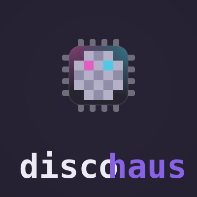</p>

## Marks

| entity | chip | avatar | lockup | favicon | |
| --- | :-: | :-: | :-: | :-: | --- |
| **discohaus**<br><sub>org</sub> | 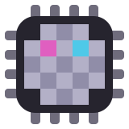 | 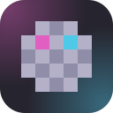 |  | 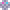 | 5x5 mirror ball: chrome with magenta and cyan facets. |
| **discopanel**<br><sub>product</sub> | 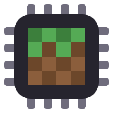 | 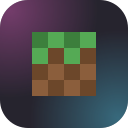 | 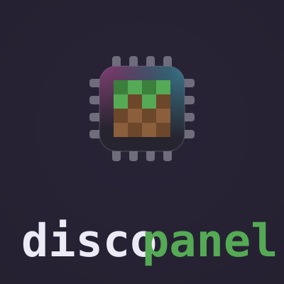 | 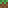 | Grass block: green cap, jagged boundary row, two-tone dirt. |
| **discoruntime**<br><sub>product</sub> | 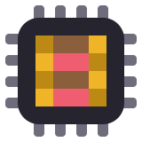 | 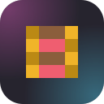 | 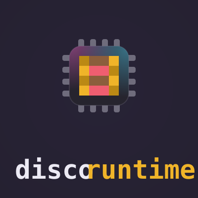 | 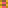 | Powered rail: gold, wood ties, redstone. |
| **discomodule**<br><sub>product</sub> | 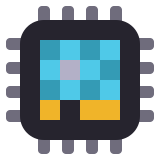 | 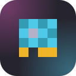 | 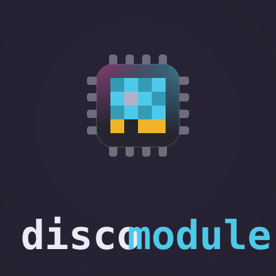 | 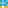 | Memory stick: cyan card, chrome chip, gold connector. |
| **doctor**<br><sub>module</sub> | 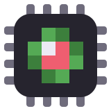 | 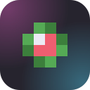 | 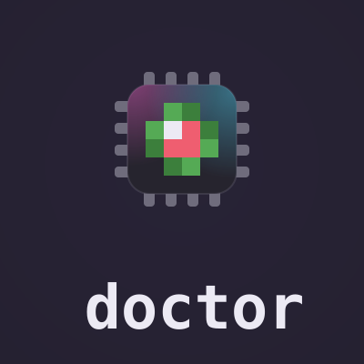 | 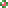 | Green cross, red heart, white glint. |
| **status**<br><sub>module</sub> | 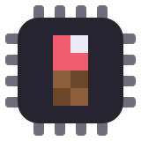 | 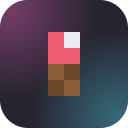 | 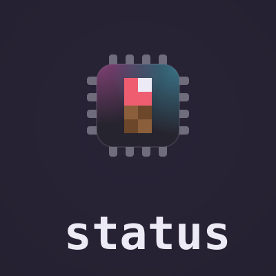 | 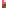 | Redstone torch; lit means up. |
| **geyser**<br><sub>module</sub> | 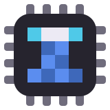 | 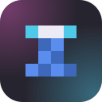 | 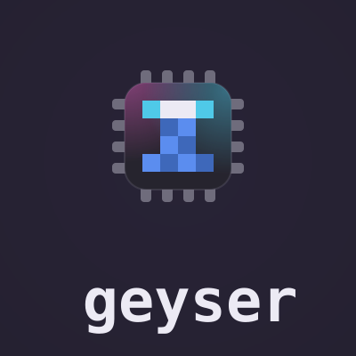 | 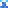 | White crown, cyan spray, blue column. |
| **steambridge**<br><sub>module</sub> | 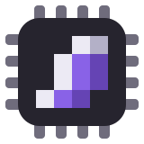 | 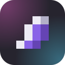 | 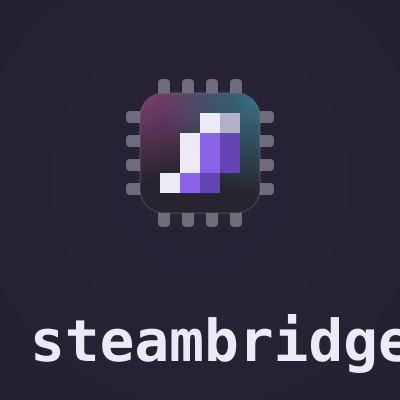 | 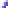 | steamclient rotated 180: violet, one chrome seed. |
| **playit**<br><sub>module</sub> | 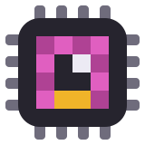 | 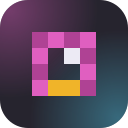 | 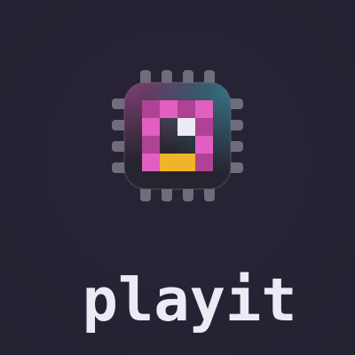 | 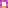 | Tunnel: magenta arch, light at the end, gold track. |
| **exporter**<br><sub>module</sub> | 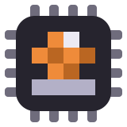 | 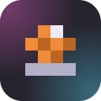 | 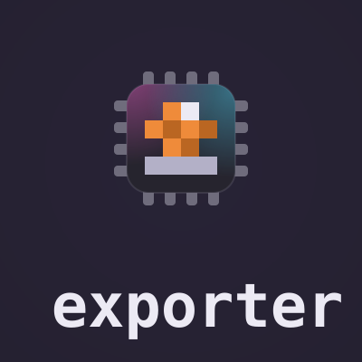 | 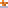 | Orange arrow off a chrome tray, glint on the tip. |
| **steamclient**<br><sub>client</sub> | 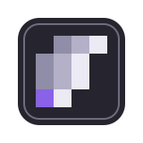 | 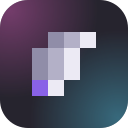 | 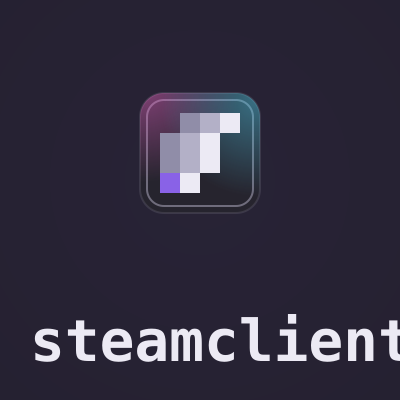 | 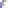 | Chrome wisp, one violet seed; counterpart of steambridge. |
| **somefuturemod**<br><sub>fallback demo</sub> | 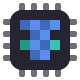 | 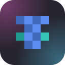 | 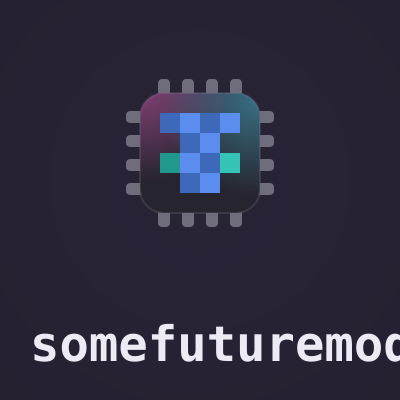 | 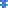 | Fallback demo: unauthored tile, 4x4 identicon from sha256(id). |

## The rule

Every sprite is an NxN grid of cells, N <= 5. Every cell is 2 units. Rendered size = 2N units, centered. N=4 fills the 8-unit slot; N=3 centers with a 1-unit margin; N=5 is reserved for the org ball, which overflows the slot by exactly 1 unit per side.

Every sprite renders as exactly four hexes. The majority key (the material) dithers by parity: (x+y) odd -> hi, even -> lo. Two minority keys render flat at hi; a single minority key dithers as a second material. Identicon fallbacks derive a material plus a mirrored accent pair from the hash.
